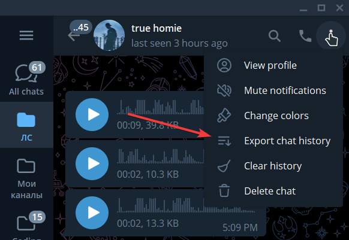
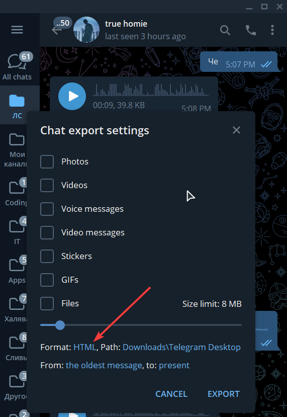
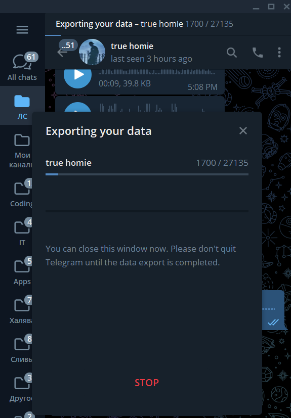
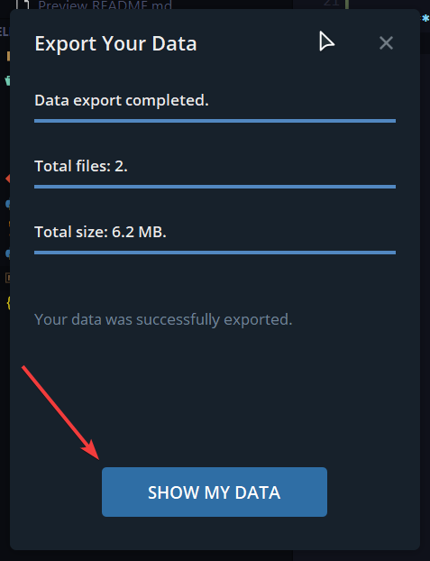
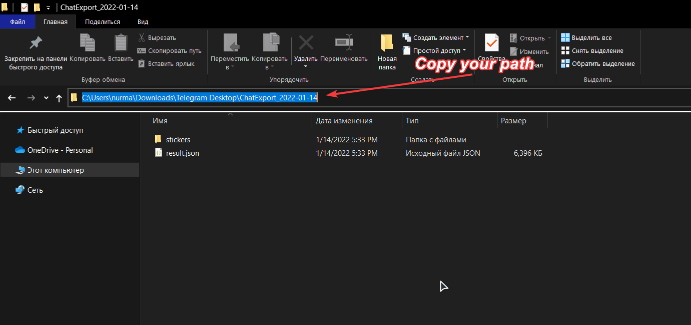

# telegramCounter
A tool for getting statistics of the history of messages in the telegram messenger

## **How to use**
To get statistics, you need to provide me with your correspondence history as a json file.  
You can do this through the computer version of the messenger.  
See below how to do this  

### ***First step:***  
Click on the **«Export chat history»** button in the opened menu


### ***Second step:***
Then a window with settings will open. You can choose which media data you want to export. I don't choose anything. **Text only**.  
After that, you need to change the extension from HTML to **json**.


### ***Fourth step:***
When you have selected the json extension, you need to click on the **«Export»** button. The download window opens  


### ***Fifth step:***
When the download is finished, another window will open where you will need to click on the **«show my data»** button  


### ***Sixth step:***
Then explorer will open. U need to copy path to the **«result.json»** file  


### ***Almost finish:***
Now it remains to run the program itself. To do this, go to the project folder.   
Write the ```pip install rich``` command. This is one of the dependencies. 
Then you can run the  utility: ```python main.py```  
> Previously, it means that you have executed the ```git clone https://github.com/mr-SkyDev/telegramCounter.git``` command